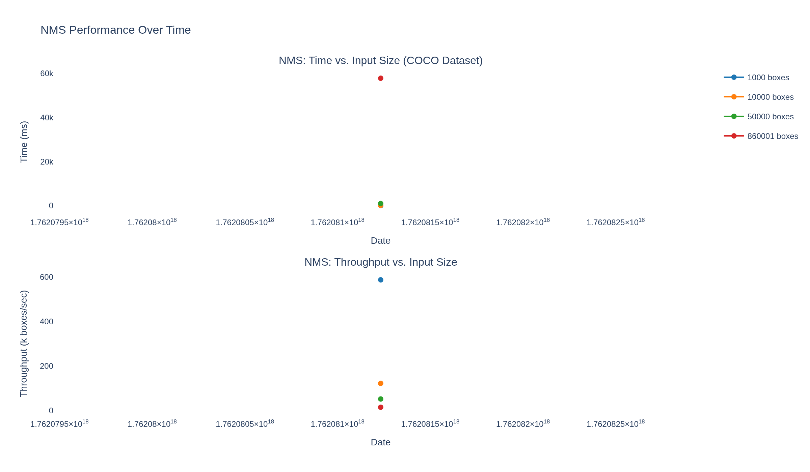
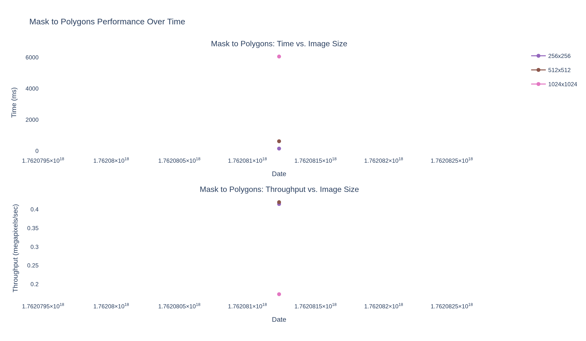

# rust-nms Performance Benchmarks

This directory contains the automated performance monitoring system for rust-nms. Benchmarks run on every PR and track performance trends over time using real COCO dataset annotations.

## Performance Trends

### NMS Performance


### Mask to Polygons Performance


## Overview

The benchmarking system consists of:

- **`run_benchmarks.py`**: Runs comprehensive benchmarks on both NMS and mask_to_polygons operations
- **`generate_dashboard.py`**: Generates performance trend charts as PNG images
- **`history.json`**: Stores historical benchmark results
- **`nms_performance.png`**: NMS performance trends chart (auto-generated)
- **`mask_performance.png`**: Mask to polygons performance trends chart (auto-generated)

## Quick Start

### Running Benchmarks Locally

1. **Build rust-nms in release mode:**
   ```bash
   pip install maturin
   maturin develop --release
   ```

2. **Install benchmark dependencies:**
   ```bash
   cd benchmarks
   pip install -r requirements.txt
   ```

3. **Run benchmarks:**
   ```bash
   python run_benchmarks.py
   ```

   On first run, this will download COCO annotations (~250MB, cached for future runs).

4. **Generate performance charts:**
   ```bash
   python generate_dashboard.py
   ```

   This creates `nms_performance.png` and `mask_performance.png` which are displayed in this README.

## What Gets Benchmarked

### NMS Operation (using COCO train2017 annotations)
- **1,000 boxes**: Quick smoke test
- **10,000 boxes**: Standard workload
- **50,000 boxes**: Large-scale scenario
- **Full dataset** (~860k boxes): Maximum stress test

Each benchmark measures:
- Average execution time (ms)
- Standard deviation
- Throughput (boxes/second)
- Number of boxes kept after NMS

### Mask to Polygons Operation
- **256x256**: Small images
- **512x512**: Medium images
- **1024x1024**: Large images (standard for instance segmentation)

Each benchmark measures:
- Average execution time (ms)
- Standard deviation
- Throughput (megapixels/second)
- Number of polygons extracted

## CI/CD Integration

Benchmarks run automatically on every commit via GitHub Actions:

1. **On every commit**: Runs comprehensive benchmarks using COCO dataset
2. **On PR commits**: Posts performance comparison comment showing changes vs main
3. **On commits to main**: Updates `history.json` and regenerates performance charts

The charts are committed back to the repository so you can view performance trends directly in this README.

## Data Format

### history.json Structure

```json
[
  {
    "timestamp": "2025-11-02T10:30:00Z",
    "commit": "abc123...",
    "branch": "main",
    "benchmarks": {
      "nms_1000": {
        "time_ms": 1.23,
        "time_std_ms": 0.05,
        "throughput_boxes_per_sec": 812345,
        "n_boxes": 1000,
        "n_kept": 234,
        "n_runs": 5,
        "dataset": "coco_train2017"
      },
      "mask_to_polygons_1024": {
        "time_ms": 5.67,
        "time_std_ms": 0.12,
        "throughput_megapixels_per_sec": 186.3,
        "size": "1024x1024",
        "n_polygons": 42,
        "n_runs": 5
      }
      // ... more benchmarks
    }
  }
  // ... more entries
]
```

## Performance Charts

The generated charts include:

- **Time-series plots**: Track performance changes over commits
- **Multi-scale comparison**: Compare performance across different input sizes
- **Throughput visualization**: See boxes/sec and megapixels/sec trends
- **Statistical details**: Mean and standard deviation for each benchmark

## Performance Baselines

Expected performance on modern hardware (M1/M2 Mac, recent Intel/AMD):

| Operation | Input Size | Time | Throughput |
|-----------|-----------|------|------------|
| NMS | 10,000 boxes | ~15ms | ~660k boxes/sec |
| NMS | 100,000 boxes | ~150ms | ~660k boxes/sec |
| Mask to Polygons | 1024x1024 | ~5ms | ~200 MP/sec |

## Interpreting Results

### Good Signs ✅
- Consistent performance across runs (low std dev)
- Throughput stays constant or improves over time
- Performance scales predictably with input size

### Warning Signs ⚠️
- Sudden performance drops (>10% regression)
- High variance between runs
- Non-linear scaling for large inputs

### Performance Regressions

If your PR shows performance regressions:

1. **Check the magnitude**: <5% is noise, >10% needs investigation
2. **Verify the benchmark**: Re-run locally to confirm
3. **Profile the code**: Use `cargo flamegraph` to find bottlenecks
4. **Consider tradeoffs**: Sometimes correctness > speed

## COCO Dataset

The benchmarks use COCO train2017 annotations for realistic testing:
- **Source**: http://images.cocodataset.org/annotations/annotations_trainval2017.zip
- **Size**: ~250MB (annotations only, no images)
- **Cached**: Downloaded once to `benchmarks/coco_cache/`
- **Format**: JSON with bounding boxes in `[x, y, width, height]` format

## Troubleshooting

### "rust_nms module not found"
```bash
# Build in release mode
maturin develop --release
```

### "COCO download failed"
Check your internet connection and try again. The download will resume if interrupted.

### Charts show no data
Make sure `history.json` contains benchmark entries. Run `python run_benchmarks.py` first, then generate charts.

### Benchmarks are slow
Benchmarks use COCO data and may take a few minutes on first run. Subsequent runs are faster (cached annotations).

## Contributing

When adding new operations to benchmark:

1. Add benchmark function in `run_benchmarks.py`
2. Update `generate_dashboard.py` to add chart for new metrics
3. Document expected performance in this README
4. Update CI workflow if needed
5. Regenerate charts with `python generate_dashboard.py`

## License

Same as rust-nms (see main repository).
